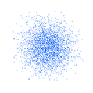
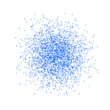
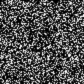
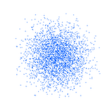
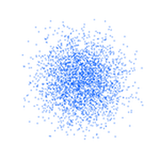

# JAX Generative Models

[](./LICENSE)
[](https://www.python.org/)
[](https://github.com/google/jax)
<br/>
[](https://github.com/brentyi/tyro)
[](https://rerun.io/)
[](https://github.com/astral-sh/uv)
[](https://github.com/pre-commit/pre-commit)
[](https://github.com/MizuhoAOKI/jax_generative_models/actions/workflows/lint.yaml)
[](https://github.com/MizuhoAOKI/jax_generative_models/actions/workflows/type_check.yaml)
[](https://github.com/MizuhoAOKI/jax_generative_models/actions/workflows/test.yaml)

**Minimal JAX implementation that unifies Diffusion and Flow Matching under a shared interface.**

`jax_generative_models` provides a unified interface for Diffusion and Flow Matching algorithms in JAX.
By abstracting these methods behind a common "strategy" interface, the project highlights both their
structural similarities and differences. With Tyro for configuration and Rerun for visualization, it
serves as a compact yet extensible base for experimenting with generative models.

|                    |      cat      | moon | swiss-roll | mnist |
| :----------------  | :-------------------------------------: | :-----------------------------------: | :-----------------------------------: | :-----------------------------------: |
| Diffusion (DDPM)   |  |  |  |  |
| Flow Matching      |  |  |  |  |

## Getting Started

1. Prerequisites
    - [uv](https://docs.astral.sh/uv/getting-started/installation/)<br/>
        A simple and fast Python package manager.
        Refer to the official documentation for one-command installation.
    - [make](https://www.gnu.org/software/make/)<br/>
      Used to run shortcuts such as `make setup`.
      It is optional, so you can also run the commands in the `Makefile` manually.
    - CUDA 12 (or a compatible version) and an NVIDIA GPU
      Required for GPU acceleration with JAX.

2. **Clone the repository**
    ```bash
    cd <path-to-your-workspace>
    git clone https://github.com/MizuhoAOKI/jax_generative_models.git
    ```

3. **Set up the virtual environment and install dependencies**
    ```bash
    cd jax_generative_models
    ```
    - For CPU only:
        ```bash
        make setup_cpu
        ```
    - For GPU with CUDA 12 support:
        ```bash
        make setup_gpu_cuda12
        ```

        If you are using a GPU, set up CUDA-related environment variables:

        ```bash
        cd jax_generative_models
        source setup_gpu.sh
        ```

        Run this in every new shell before executing training/generation scripts.

4. **Train a generative model**
    ```bash
    uv run scripts/main.py train strategy:<STRATEGY_NAME> model:<MODEL_NAME> dataset:<DATASET_NAME>
    ```

5. **Generate samples from a trained model**
    ```bash
    uv run scripts/main.py generate strategy:<STRATEGY_NAME> model:<MODEL_NAME> dataset:<DATASET_NAME>
    ```

6. **Make an animation of the transport process after training**
    ```bash
    uv run scripts/main.py animate strategy:<STRATEGY_NAME> model:<MODEL_NAME> dataset:<DATASET_NAME>
    ```

7. **Visualize training progress**

    [Rerun](https://rerun.io/) is a visualization tool that allows you to monitor training progress in real time, or to inspect logged results afterward.
    Run Rerun from another terminal:
    ```bash
    make rerun
    ```

    https://github.com/user-attachments/assets/a5541eed-7a38-4931-ba5e-154278487a13


### Command Arguments

You can replace the placeholders in the commands above with the following options.
If omitted, each argument falls back to its default value.

| Placeholder         | Options                               | Default | Description                         |
| :------------------ | :------------------------------------- | :------ | :----------------------------------- |
| `<STRATEGY_NAME>`   | `ddpm`, `flow-matching`                | `ddpm`  | Generative modeling strategy.        |
| `<MODEL_NAME>`      | `mlp`, `resnet`, `unet`                | `mlp`   | Model architecture to use.           |
| `<DATASET_NAME>`    | `cat`, `gaussian-mixture`, `moon`, `swiss-roll`, `mnist` | `cat` | Target dataset for training/generation. |

For example, to train a DDPM with an MLP on the "cat" dataset (the default configuration), run:

```bash
uv run scripts/main.py train strategy:ddpm model:mlp dataset:cat
```

The `unet` model is specifically designed for image data like `mnist`, so it should be used with image-based datasets.
The following command shows a recommended set of parameters for training `unet` on `mnist` using the `flow-matching` strategy:

```bash
uv run scripts/main.py train --batch-size 128 --vis.num-vis-samples 256 strategy:flow-matching --strategy.num-transport-steps 100 model:unet dataset:mnist
```

You can then generate samples conditioned on a specific digit.
For example, the following command generates 100 images of the digit "5":

```bash
uv run scripts/main.py generate --condition 5 --num-samples 100 strategy:flow-matching model:unet dataset:mnist
```

If you omit the `--condition` option, the model will generate random digits from 0 to 9.


## References
- Ho et al. [*Denoising Diffusion Probabilistic Models.*](https://arxiv.org/abs/2006.11239) 2020.
- Lipman et al. [*Flow Matching for Generative Modeling.*](https://arxiv.org/abs/2210.02747) 2023.
- Holderrieth et al. [*An Introduction to Flow Matching and Diffusion Models.*](https://arxiv.org/pdf/2506.02070) 2025.
- Lipman et al. [*Flow Matching Guide and Code.*](https://arxiv.org/pdf/2412.06264) 2024.
